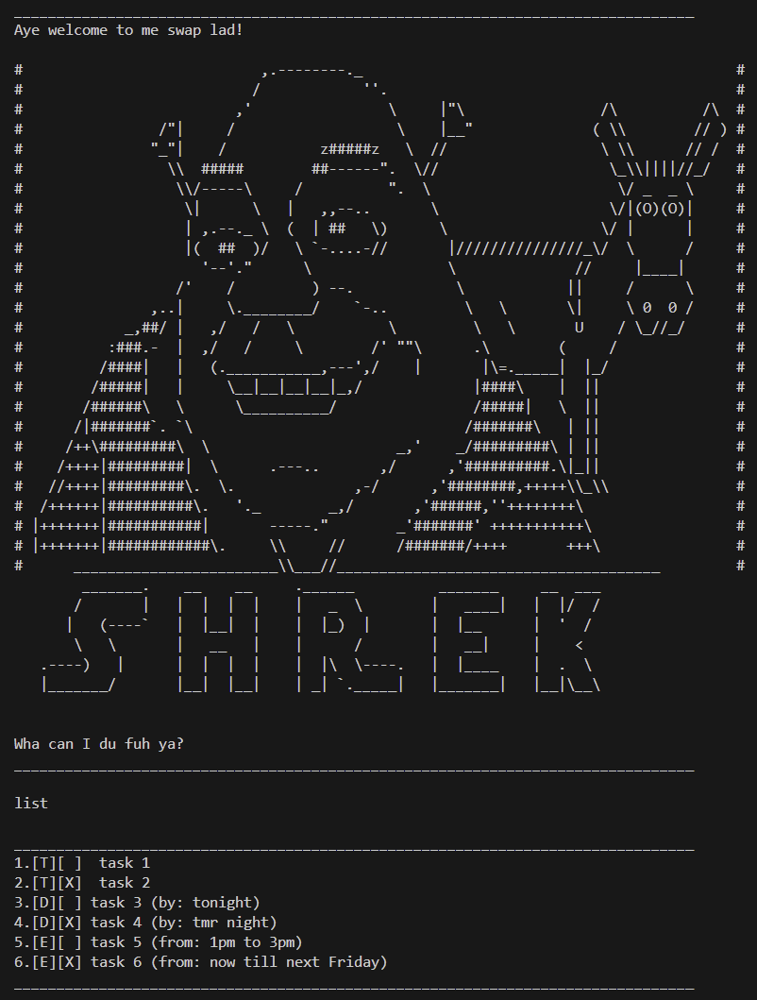

# Shrek User Guide

 

Shrek is a simple command-line task manager that helps users organize their tasks efficiently. It supports adding, marking, deleting, and searching for tasks, including ToDos, Deadlines, and Events. Designed for a smooth CLI experience, Shrek ensures seamless task tracking and management.

## Viewing Existing Tasks
Enter `list` into the command line to view existing tasks

## Exitting and Saving
Enter `bye` into the command line to exit application. 
Doing so will also save all changes made to your tasks.
Be careful not to force exit the application, as this will not save any changes.
The only way to save any changes is using `bye`

## Adding ToDos
Todos are tasks that dont require specified timeframes,
you need only to specify the name of the task.

Enter `todo [name]` into the command line to add a ToDo task,
replace [name] with the actual name of the task

Example: `todo submit Shrek` 

If no input errors have occurred, this is the expected output:
> Aye, got it lad! Here's your input
[T][ ] submit Shrek
Yer now got 1 tasks in yer list

viewing `list` should also show that your changes have been implemented into the tasklist

## Adding Deadlines
Deadlines are tasks that require specified timeframes,
you need to specify the name of the task, a special descriptor, and the timeframe.

Enter `deadline [name] /by [time]` into the command line to add a Dealine task,
replace [name] and [time] with the actual name and time of the task

Example: `deadline submit Shrek /by Fri, Mar 14th 2359` 

If no input errors have occurred, this is the expected output:
> Aye, got it lad! Here's your input
[D][ ] submit Shrek (by: Fri, Mar 14th 2359)
Yer now got 2 tasks in yer list

Viewing `list` should also show that your changes have been implemented into the tasklist

## Adding Events
Events are tasks that require specified timeframes,
you need to specify the name of the task, a special descriptor, and the timeframe.

Enter `events [name] /from [time]` into the command line to add an Event task,
replace [name] and [time] with the actual name and time of the task

Example: `event work on Shrek /from Today to Fri, Mar 14th 2359` 

If no input errors have occurred, this is the expected output:
> Aye, got it lad! Here's your input
[E][ ] work on Shrek (from: Today to Fri, Mar 14th 2359)
Yer now got 3 tasks in yer list

Viewing `list` should also show that your changes have been implemented into the tasklist

## Marking / Unmarking Task
If you wish to mark on unmark a task on the list, you need to know the index of the task
It may be useful to use `list` to confirm the index of the task prior to marking / unmarking

Enter `mark [index]` or `unmark [index]` to mark or unmark the task

Example: `mark 2` or `unmark 2`

If no input errors have occurred, this is the expected output:
> Roger that! Consider task 2 marked.

Viewing `list` should also show that your changes have been implemented into the tasklist

## Deleting Task
If you wish to remove a task from the list, you need to know the index of the task
It may be useful to use `list` to confirm the index of the task prior to deleting

Enter `delete [index]` to delete the task

Example: `delete 1`

If no input errors have occurred, this is the expected output:
> Aye, got it lad! Here's what I deleted
[T][ ] submit Shrek
Yer now got 2 tasks in yer list

Viewing `list` should also show that your changes have been implemented into the tasklist

## Finding Tasks
You can search for all tasks in your tsklist that have a specified key

Enter `find [key]` into the command line to search,
replace [key] with the actual name of the key.

Example: `find Shrek` 

If no input errors have occurred, this is the expected output:
> HERE ARE ALL THE TASKS THAT CONTAIN "Shrek"
1.[T][ ] submit Shrek
2.[D][X] submit Shrek (by: Fri, Mar 14th 2359)
3.[E][ ] work on Shrek (from: Today to Fri, Mar 14th 2359)
